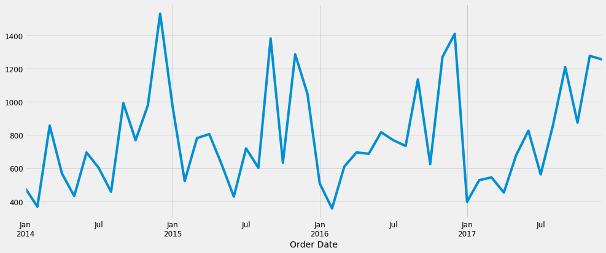
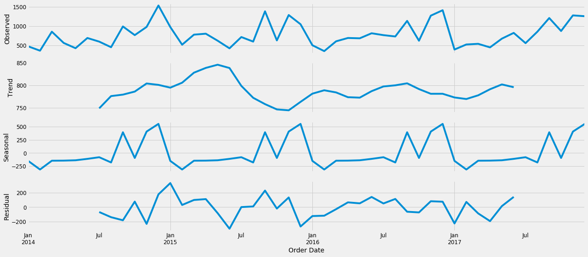
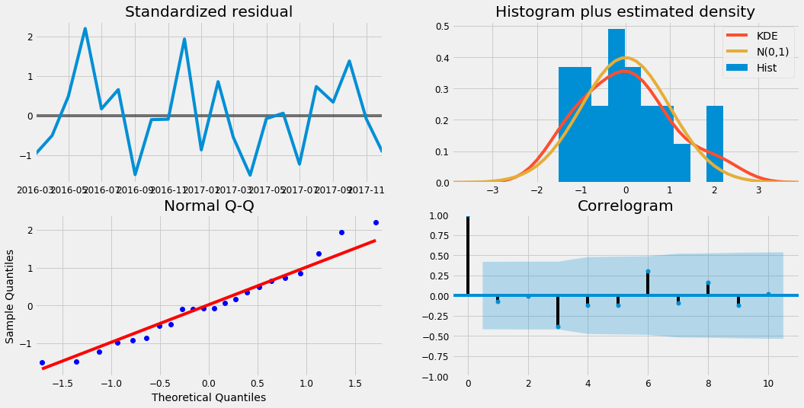
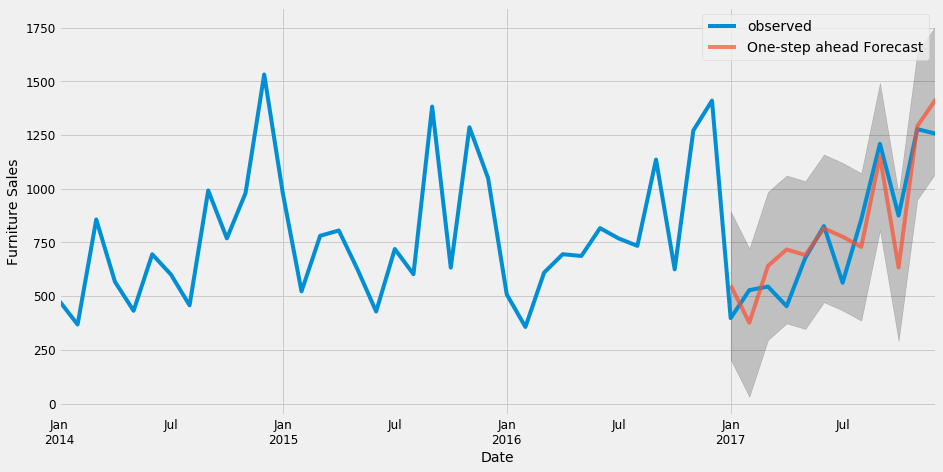
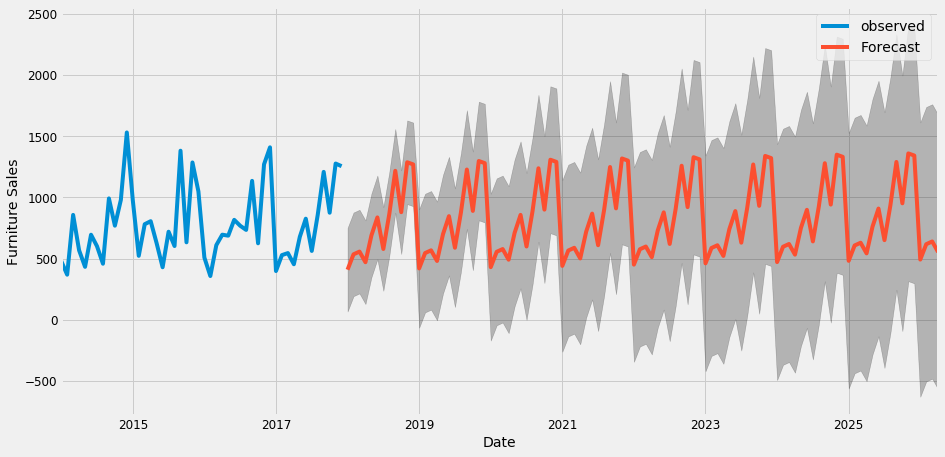
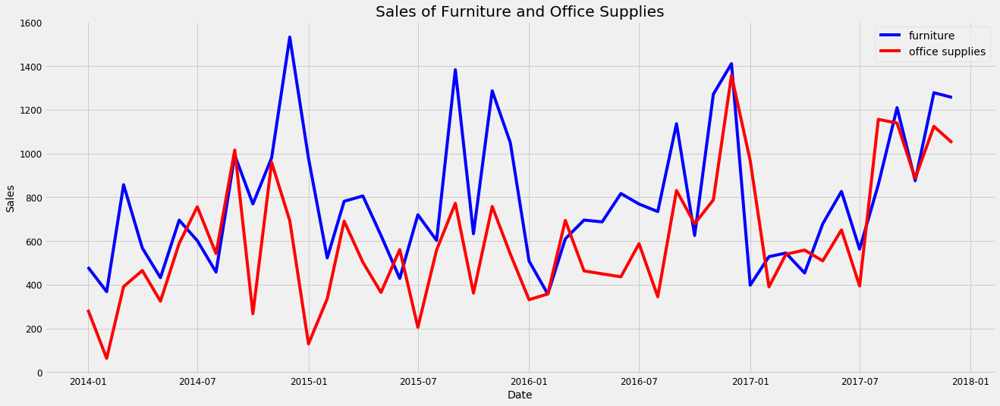
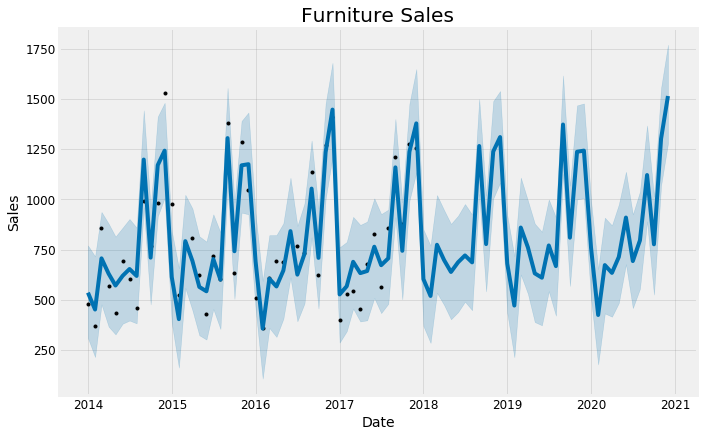
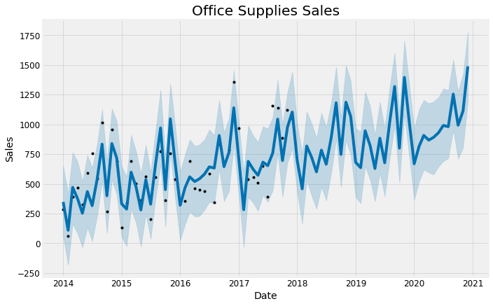
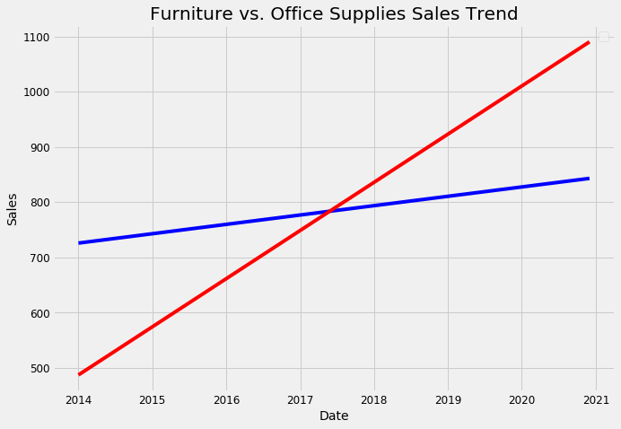
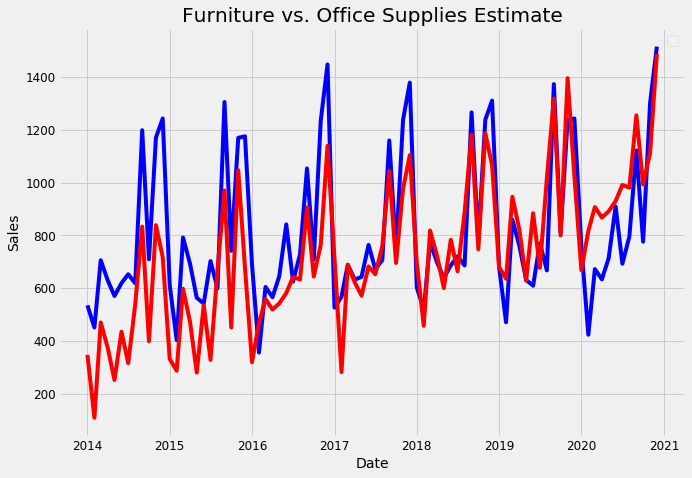

# Time-Series-Prediction-ARIMA-and-PROPHET
A time series is a sequence where a metric is recorded over regular time intervals.

Depending on the frequency, a time series can be of yearly (ex: annual budget), quarterly (ex: expenses), monthly (ex: air traffic), weekly (ex: sales qty), daily (ex: weather), hourly (ex: stocks price), minutes (ex: inbound calls in a call canter) and even seconds wise (ex: web traffic).
## Furniture Sales Vs Date

## Furniture data Decomposition

## ARIMA Model Daignostics for Furniture Sales

## Observed vs one step ahead Forecast plots

## Forecast furniture sale using ARIMA

## Sales Furniture vs Office Supplies

## PROPHET Given Furniture Sales

## PROPHET Given Office Sales

## Furniture vs. Office Supplies Sales Trend

## Furniture vs. Office Supplies Estimate

